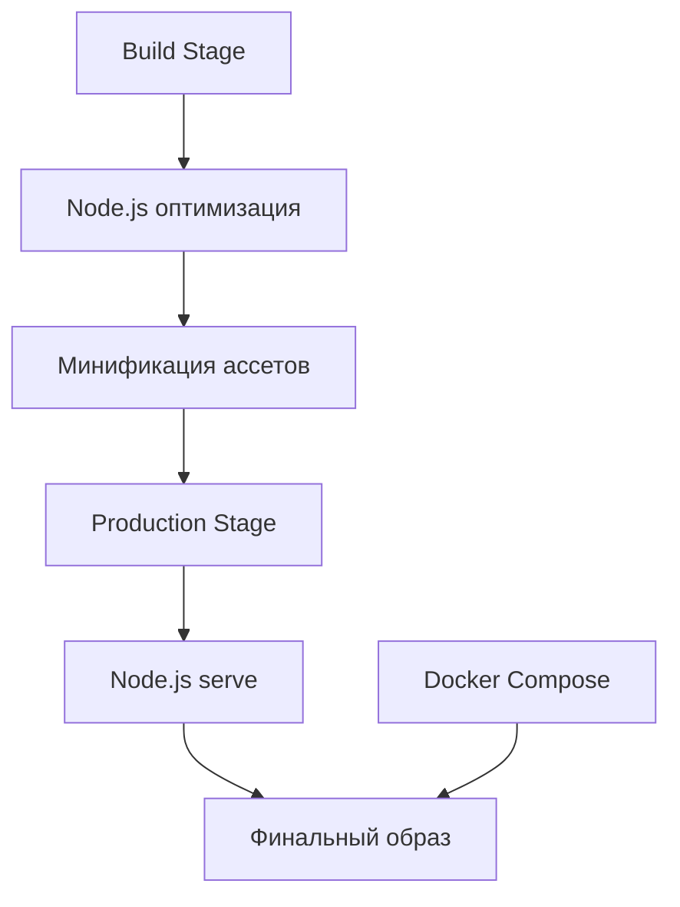

# План развертывания портфолио в Docker

## Архитектура решения



## Конфигурационные файлы

### package.json

```json
{
  "scripts": {
    "optimize:css": "postcss styles/**/*.css -d dist/styles",
    "optimize:js": "terser js/**/*.js -o dist/js/bundle.min.js",
    "optimize:images": "imagemin assets/images/* -o dist/assets/images",
    "build": "npm run optimize:css && npm run optimize:js && npm run optimize:images",
    "start": "serve -s dist -l 80"
  },
  "dependencies": {
    "serve": "^14.0.0"
  },
  "devDependencies": {
    "postcss-cli": "^8.3.1",
    "postcss-preset-env": "^7.0.0",
    "cssnano": "^5.0.0",
    "terser": "^5.7.0",
    "imagemin-cli": "^7.0.0",
    "imagemin-mozjpeg": "^9.0.0",
    "imagemin-pngquant": "^9.0.0"
  }
}
```

### Dockerfile

```dockerfile
# Build stage
FROM node:alpine as builder

WORKDIR /app
COPY package*.json ./
RUN npm install

COPY . .
RUN npm run build

# Production stage
FROM node:alpine

WORKDIR /app

# Устанавливаем только serve
RUN npm install -g serve

# Копируем только оптимизированные файлы
COPY --from=builder /app/dist ./dist
COPY --from=builder /app/index.html ./dist/

# Создаем непривилегированного пользователя
RUN addgroup -S appgroup && \
    adduser -S appuser -G appgroup && \
    chown -R appuser:appgroup /app

USER appuser

EXPOSE 80

# Запускаем serve
CMD ["serve", "-s", "dist", "-l", "80"]
```

### docker-compose.yml

```yaml
version: '3.8'
services:
  portfolio:
    build:
      context: .
      dockerfile: Dockerfile
    ports:
      - "2999:80"
    healthcheck:
      test: ["CMD", "wget", "-q", "--spider", "http://localhost:80"]
      interval: 30s
      timeout: 10s
      retries: 3
    restart: unless-stopped
    logging:
      driver: "json-file"
      options:
        max-size: "10m"
        max-file: "3"
    deploy:
      resources:
        limits:
          cpus: '0.5'
          memory: 256M
        reservations:
          cpus: '0.25'
          memory: 128M
```

## Преимущества выбранного подхода

1. Меньший размер финального образа (без Nginx)
2. Простая конфигурация без дополнительных конфигурационных файлов
3. Встроенная поддержка сжатия и кэширования в serve
4. Автоматическая обработка SPA роутинга
5. Меньшее потребление памяти
6. Быстрый старт контейнера
7. Ограничение использования ресурсов
8. Оптимизация всех статических файлов (CSS, JS, изображения)

## Процесс развертывания

1. Создание необходимых файлов:
   - package.json
   - Dockerfile
   - docker-compose.yml

2. Сборка Docker образа:
```bash
docker-compose build
```

3. Запуск контейнера:
```bash
docker-compose up -d
```

4. Проверка доступности сайта:
```bash
curl http://localhost:2999
```

## Мониторинг и обслуживание

1. Проверка логов:
```bash
docker-compose logs -f
```

2. Проверка состояния контейнера:
```bash
docker-compose ps
```

3. Перезапуск сервиса:
```bash
docker-compose restart
```

4. Обновление версии:
```bash
docker-compose down
docker-compose build --no-cache
docker-compose up -d